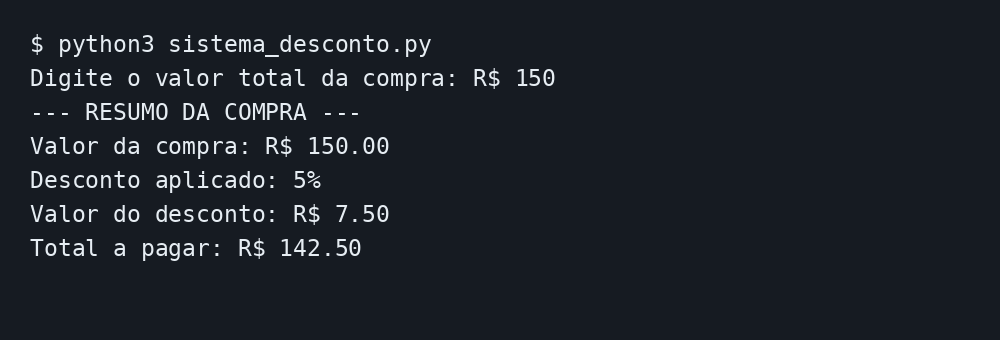

# Sistema de Desconto Progressivo

Programa desenvolvido em Python para calcular o desconto de uma compra e o valor final que deverá ser pago pelo cliente.

## Regras de desconto

- Compras menores que R$ 200,00 recebem 5% de desconto;
- Compras maiores ou iguais a R$ 200,00 e menores que R$ 300,00 recebem 10% de desconto;
- Compras maiores ou iguais a R$ 300,00 recebem 15% de desconto.

## Funcionamento do programa

O programa solicita que o usuário digite o valor total da compra. Em seguida, utiliza as estruturas condicionais `if`, `elif` e `else` para determinar a porcentagem de desconto.

Depois disso, o programa calcula:

- O valor do desconto;
- O valor final da compra;
- A porcentagem de desconto aplicada.

Por fim, os resultados são exibidos na tela.

## Como executar

1. Tenha o Python 3 instalado;
2. Baixe o arquivo `sistema_desconto.py`;
3. Abra o arquivo em um editor de código;
4. Execute o programa;
5. Digite o valor total da compra;
6. Confira o desconto e o total a pagar.

## Testes de funcionamento

### Teste 1 — Desconto de 5%

Valor utilizado: R$ 150,00.

### Teste 2 — Desconto de 10%

Valor utilizado: R$ 250,00.

### Teste 3 — Desconto de 15%

Valor utilizado: R$ 350,00.

## Autora

Letícia Polatto
